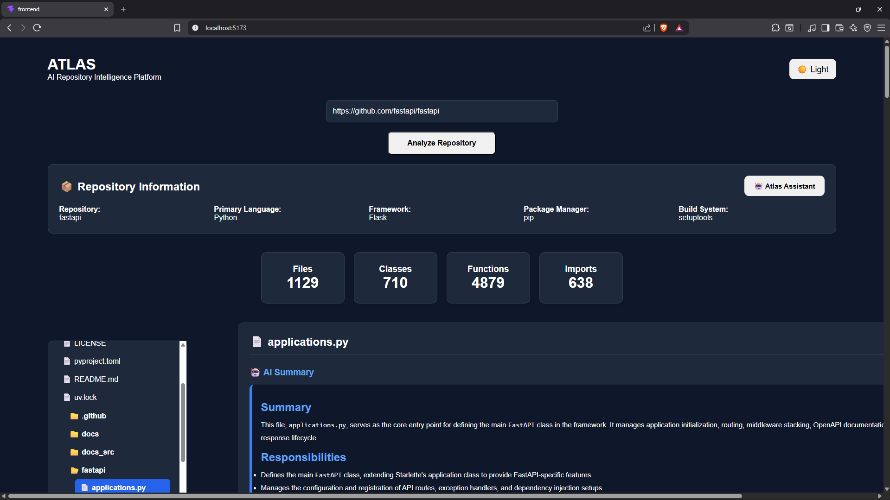
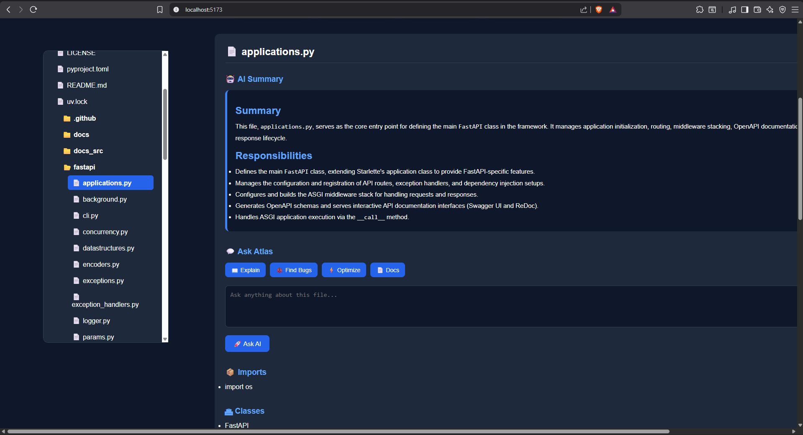
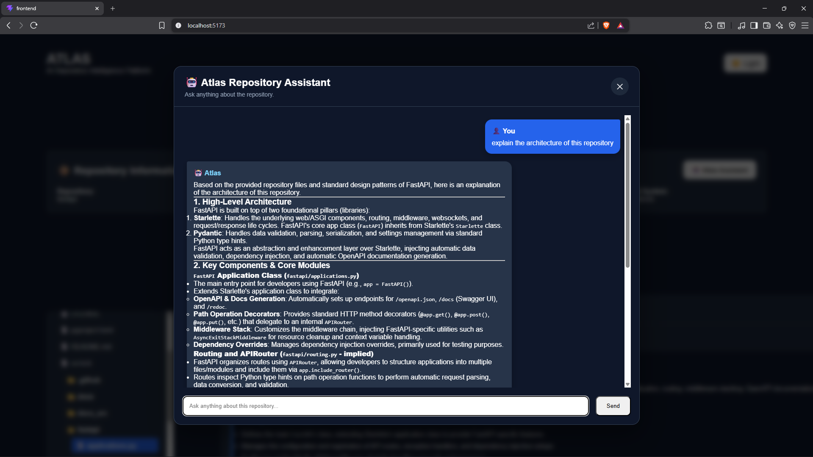
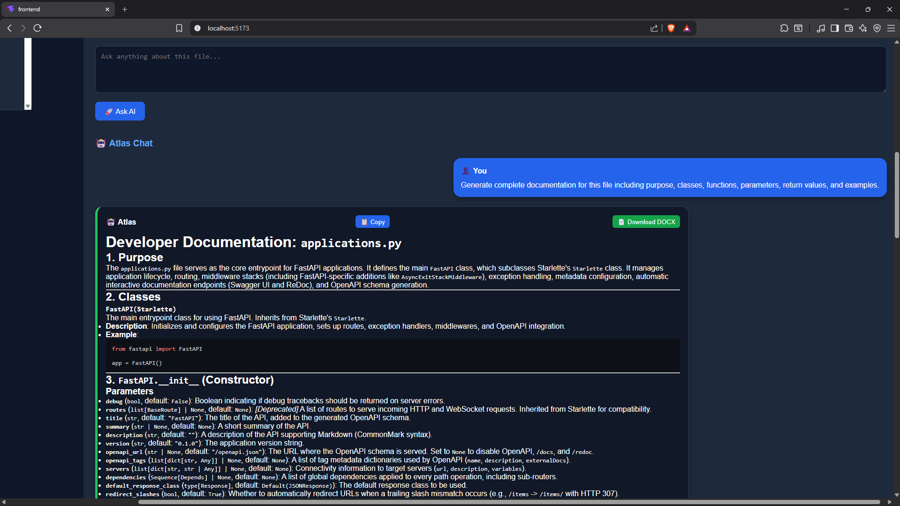
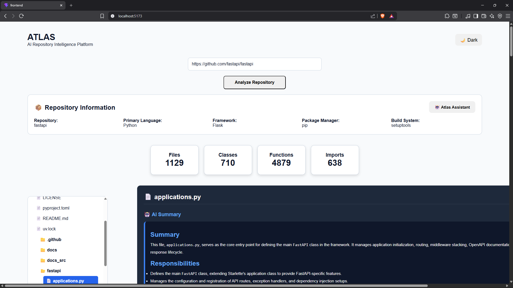

# 🚀 Atlas

> **AI-Powered Repository Intelligence Platform**

Atlas is an AI-powered repository analysis platform that helps developers understand unfamiliar codebases in seconds. By combining static code analysis, Tree-sitter parsing, and Google's Gemini AI, Atlas provides intelligent repository insights, file-level explanations, bug detection, optimization suggestions, and automated developer documentation generation.

---

## 📸 Application Overview

---

## ✨ Features

- 🔍 Analyze any public GitHub repository
- 🌳 Interactive repository structure explorer
- 🤖 AI-generated repository insights
- 📄 Intelligent file analysis
- 💬 Chat with individual source files
- 🧠 Repository-wide AI Assistant
- 🐞 AI-powered bug detection
- ⚡ Code optimization suggestions
- 📚 Automatic developer documentation generation
- 📥 Export documentation as DOCX
- 📋 One-click copy for AI responses
- 🌙 Light & Dark mode support

---

## 📸 Screenshots

### Repository Analysis

---

### Repository Assistant

---

### Documentation Generator

---

### Light Mode

